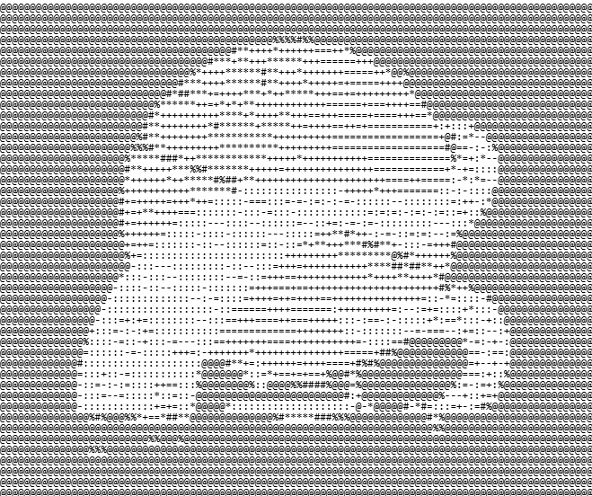

<div align="center">

# Kartikey Srivastava

### Full-Stack Engineer

</div>

---

<table width="100%">
<tr>

<td width="25%" align="center" valign="top">


<br><br>

<a href="https://github.com/kartik-ey17">

</a>

<br><br>

<a href="https://linkedin.com/in/kartikey-srivastava17">

</a>

</td>

<td width="75%" valign="top">

<table width="100%">
<tr>

<td width="45%" valign="top">

## `Readme.md`

<pre>
Name : Kartikey Srivastava

Age  : 20

Class : Full-Stack Engineer

Skills :
Python, HTML, CSS, JS, TS, Golang, Java, C++

Specializations :
FastAPI, React.js, Next.js, Node.js, PostgreSQL, DSA

Tools :
Git/GitHub, Linux, Docker
</pre>

</td>

<td width="55%" align="center" valign="middle">



</td>

</tr>
</table>

</td>

</tr>
</table>

---

## `> whoami`

I'm a Computer Science student interested in building things across the
full stack — from backend systems and databases to interactive frontends
and AI-powered applications.

Currently learning, building, breaking, and rebuilding.

---

## `> current_stack`

<table width="100%">
<tr>

<td width="33%" valign="top">

### Languages

```text
Python
JavaScript
TypeScript
C++
Java
Golang
```

</td>

<td width="33%" valign="top">

### Backend

```text
FastAPI
Node.js
PostgreSQL
REST APIs
Docker
```

</td>

<td width="33%" valign="top">

### Frontend

```text
HTML
CSS
JavaScript
React.js
Next.js
```

</td>

</tr>
</table>

---

## `> currently_building`

### 🌍 Histora

**Interactive Historical Atlas**

An interactive way to explore historical events, people, places,
and timelines.

```text
Frontend    → HTML / CSS / JavaScript
Backend     → FastAPI
Database    → PostgreSQL
Data        → Wikipedia API
```

---

## `> learning`

```text
[████████████████████]  Full-Stack Development

[██████████████░░░░░░]  System Design

[████████████░░░░░░░░]  Data Structures & Algorithms

[██████████░░░░░░░░░░]  AI / ML

[████████░░░░░░░░░░░░]  DevOps
```

---

## `> projects`

| Project | Description | Stack |
|:--|:--|:--|
| **Histora** | Interactive historical atlas | JS · FastAPI · PostgreSQL |
| **Athenum** | Research exploration & summarization | Python · AI · APIs |
| **DailyEdge** | Gamified productivity system | Python · FastAPI · AI |
| **PixelTrove** | Interactive digital marketplace | Web · JavaScript |

---

## `> github`

<div align="center">


</div>

---

## `> connect`

<div align="center">

<a href="https://github.com/kartik-ey17">

</a>

<a href="https://linkedin.com/in/kartikey-srivastava17">

</a>

</div>

---

<details>
<summary><b>terminal</b></summary>

```text
┌──────────────────────────────────────────────────────────┐
│ kartikey@github:~$                                       │
│                                                          │
│ $ whoami                                                 │
│ kartikey                                                  │
│                                                          │
│ $ status                                                 │
│ BUILDING                                                 │
│                                                          │
│ $ focus                                                  │
│ full-stack                                               │
│ systems                                                  │
│ AI                                                       │
│                                                          │
│ $ next                                                   │
│ keep building.                                           │
│                                                          │
└──────────────────────────────────────────────────────────┘
```

</details>

<details>
<summary><b>random facts</b></summary>

```text
> likes understanding how things work

> probably over-engineers side projects

> enjoys building things from scratch

> currently trying to understand system design

> terminal > GUI
```

</details>

---

<div align="center">

```text
while (alive) {
    learn();
    build();
    break();
    fix();
}
```

</div>
